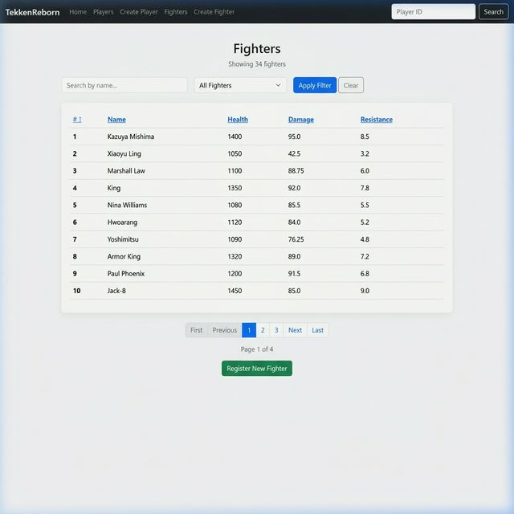
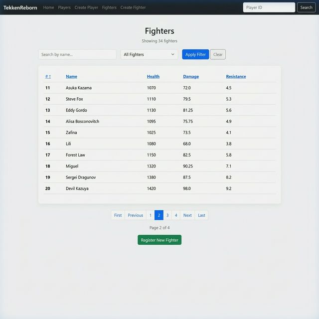
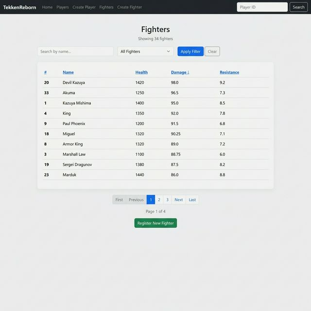
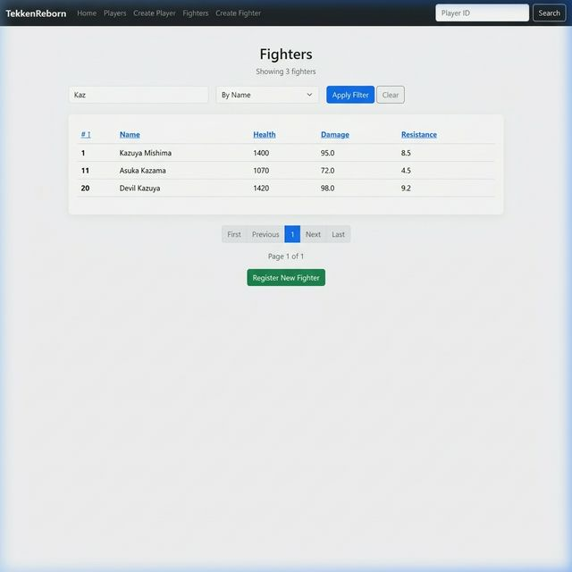
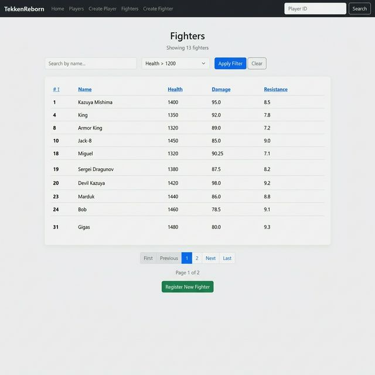
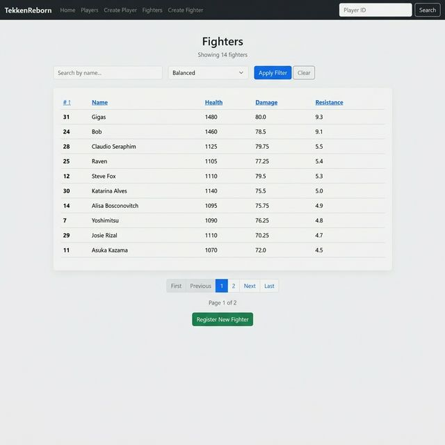

# Lab 4 - Advanced Spring Data JPA (Custom Queries & Dynamic Pagination)

## Project Overview
This project builds upon the Fighter Management application developed in Lab 3. It introduces advanced Spring Data JPA features, including:
- **Custom repository methods** using both Derived Queries and JPQL (`@Query`).
- **Dynamic search and filtering** functionality.
- **Server-side pagination and multi-criteria sorting**.
- **Enhanced Thymeleaf templates** with interactive UI components for data manipulation.

## Student Information
- **Student Name**: Harry Joseph
- **GitHub Repository**: [hjoseph777/Week7-Data-JPA-Custom-Queries](https://github.com/hjoseph777/Week7-Data-JPA-Custom-Queries)

## Key Learning Outcomes
- Implementing case-insensitive partial term search with Spring Data JPA.
- Filtering records using numeric thresholds.
- Writing custom JPQL queries for complex ranking and balancing logic.
- Managing paginated results using `Page<T>` and `Pageable`.
- Building a dynamic UI that preserves filter and sort states during navigation.

## Repository Contents
- `src/`: The complete Spring Boot source code.
- `CustomQueries_CHEATSHEET.md`: Reference for JPA query methods.
- `THYMELEAF_CHEATSHEET.md`: Reference for Thymeleaf syntax.

## Getting Started
To run the application locally:
1.  Navigate to the project root directory.
2.  Run the application: `./mvnw spring-boot:run`
3.  Access the application at: `http://localhost:8080/fighters`

---

## Lab 4 Implementation Summary

### 1. Repository Enhancements
Added custom query methods to `FighterRepository` for name searching, health filtering, and damage-based ranking.

### 2. Controller Logic
Refactored `FighterController` to handle `@RequestParam` for pagination and sorting, dynamically switching between repository methods based on user input.

### 3. UI Enhancements
Updated `Fighters.html` with a search/filter form, sortable headers with direction indicators, and a professional pagination bar.

---

## Screenshots (Manual Testing Results)

### Default View & Pagination

*Page 1 view showing the full roster sorted by ID.*

*Page 2 demonstrating functional pagination.*

### Sorting

*Fighters sorted by Damage in descending order.*

### Searching & Filtering

*Partial name search for "Kaz" using the "By Name" filter.*

*Filtering fighters with health greater than 1200.*

*Custom query ranking all fighters by damage.*

*Custom query for high health and controlled damage.*

